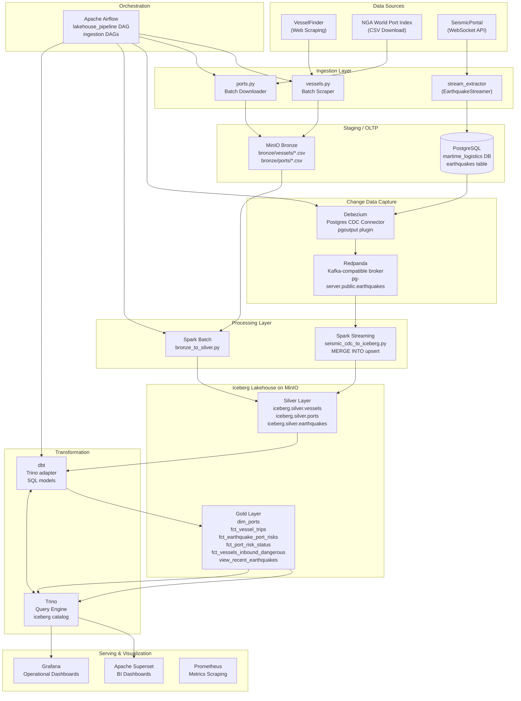
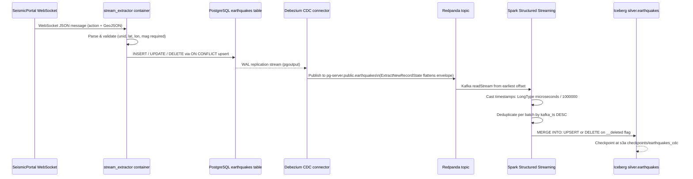
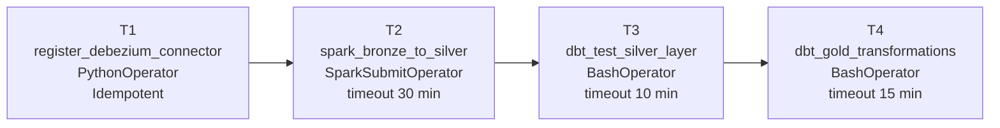
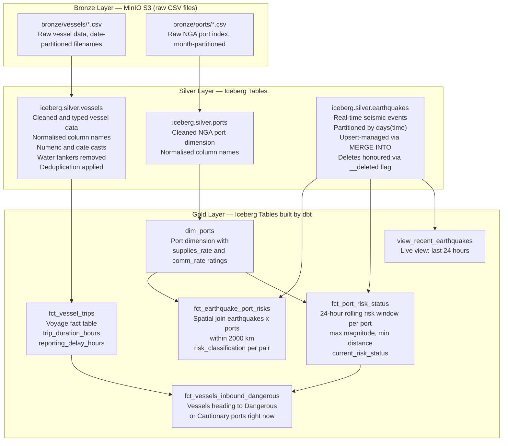
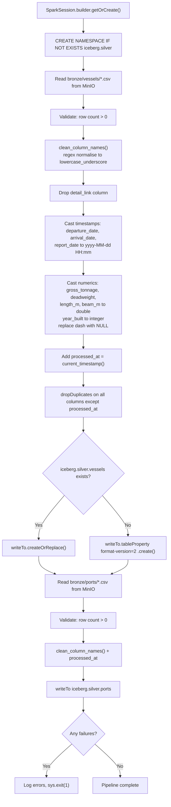
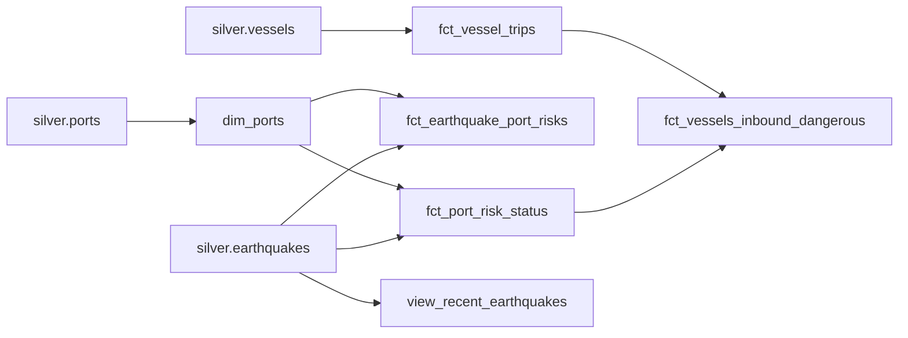
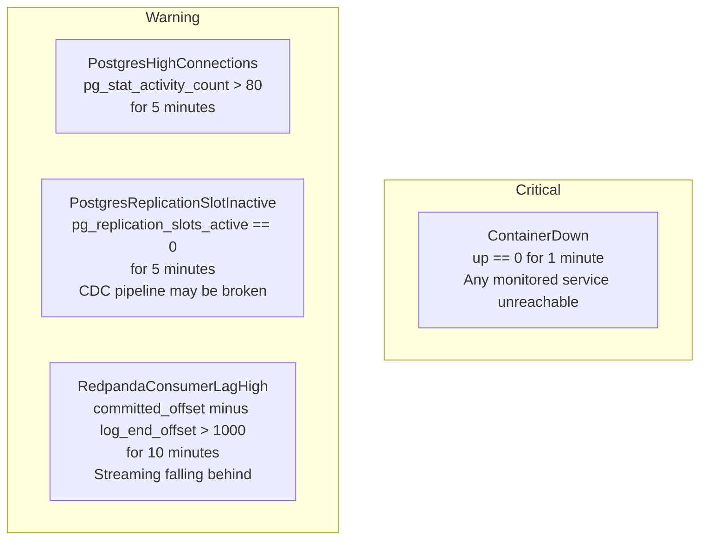
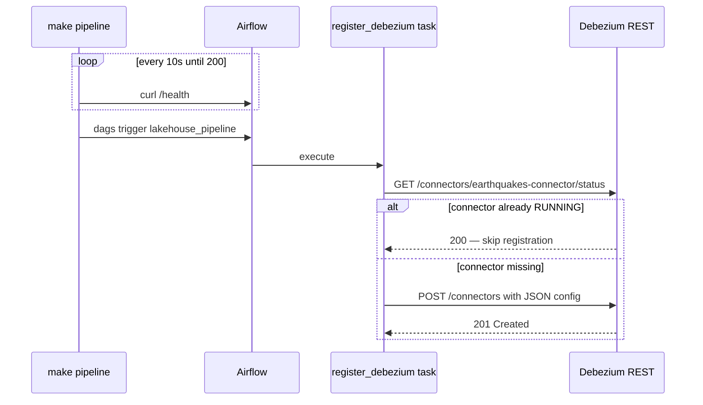

# TidaLine — Maritime Logistics Data Lakehouse

> **A production-grade, fully containerised data lakehouse** that tracks flagged vessels in real time, monitors global seismic events via live WebSocket streaming, and classifies port risk exposure — all built on Apache Iceberg, Spark, dbt, and Trino.

---

## Table of Contents

1. [Project Overview](#1-project-overview)
2. [Architecture](#2-architecture)
3. [Technology Stack](#3-technology-stack)
4. [Data Sources](#4-data-sources)
5. [Medallion Lakehouse Layers](#5-medallion-lakehouse-layers)
6. [Data Pipeline](#6-data-pipeline)
7. [Gold Layer Data Models](#7-gold-layer-data-models)
8. [Orchestration](#8-orchestration-apache-airflow)
9. [Monitoring & Alerting](#9-monitoring--alerting)
10. [Infrastructure Details](#10-infrastructure-details)
11. [Repository Structure](#11-repository-structure)
12. [Getting Started](#12-getting-started)
13. [Service Endpoints](#13-service-endpoints)
14. [Makefile Commands](#14-makefile-commands)
15. [Challenges & Solutions](#15-challenges--solutions)
16. [Design Decisions](#16-design-decisions)
17. [Environment Variables Reference](#17-environment-variables-reference)

---

## 1. Project Overview

TidaLine is a **real-time maritime intelligence platform** built as a data engineering graduation project. It answers two core operational questions:

1. **Where are flagged cargo and oil vessels going?** — Vessels are scraped daily from VesselFinder and tracked through departure → voyage → arrival with port coordinates.
2. **Are those destination ports under seismic risk right now?** — Live earthquake events are streamed continuously from the SeismicPortal WebSocket API, persisted via Change Data Capture (CDC), and spatially joined to global ports to produce dynamic risk classifications.

The result is a **Gold layer analytical dataset** that surfaces vessels heading to ports currently rated *Dangerous* or *Cautionary* due to nearby seismic activity — enabling logistics operators to make proactive rerouting decisions.

### Core Capabilities

| Capability | Detail |
|---|---|
| **Vessel tracking** | Daily scrape of flagged cargo ships (type 4) and oil/chemical tankers (type 6) from VesselFinder |
| **Port reference data** | Monthly download of the NGA World Port Index (~3,800+ global ports with coordinates and infrastructure ratings) |
| **Real-time seismic** | Sub-second ingestion of earthquake events via SeismicPortal WebSocket → PostgreSQL → Debezium CDC → Redpanda → Spark Streaming → Iceberg |
| **Risk classification** | Spatial join of earthquakes and ports; ports within 50 km of a ≥5.0 magnitude event → *Dangerous*; within 100 km of ≥4.0 → *Cautionary* |
| **Lakehouse storage** | All data stored as Apache Iceberg tables (Parquet format) on MinIO (S3-compatible object storage) |
| **Interactive analytics** | Trino SQL engine + Apache Superset BI dashboards |
| **Full observability** | Prometheus metrics collection + Grafana dashboards + alert rules |

---

## 2. Architecture

### High-Level System Architecture



### Streaming Pipeline — CDC Event Flow



### Batch Pipeline — Airflow DAG Chain



---

## 3. Technology Stack

| Component | Version | Role |
|---|---|---|
| Apache Spark | 3.5.1 | Distributed batch processing (Bronze→Silver) and Structured Streaming (CDC→Iceberg) |
| Apache Iceberg | 1.4.3 | Open table format with MERGE INTO upsert support; Parquet files on MinIO |
| Trino | latest | Distributed SQL query engine over the Iceberg lakehouse |
| dbt-core / dbt-trino | 1.8.3 / 1.8.1 | SQL-based transformation framework; builds Silver→Gold models |
| Apache Airflow | 2.9.1 | Pipeline orchestration (ingestion, batch, dbt) |
| Redpanda | v23.2.28 | Kafka-compatible event streaming broker (lower resource footprint than Kafka) |
| Debezium | latest | PostgreSQL CDC connector using pgoutput logical replication plugin |
| MinIO | latest-release | S3-compatible object storage for all Iceberg data files |
| PostgreSQL | 15 | OLTP store for real-time earthquake inserts; Iceberg JDBC catalog metadata |
| Apache Superset | latest | BI dashboards connected to Trino/Iceberg Gold layer |
| Grafana | latest | Infrastructure monitoring dashboards fed by Prometheus |
| Prometheus | latest | Metrics scraping (Postgres, Redpanda, MinIO) |
| Python | 3.12 | Batch extractors, stream extractor, orchestration scripts |

---

## 4. Data Sources

### 4.1 VesselFinder — Vessel Tracking

- **URL:** `https://www.vesselfinder.com/vessels?type=4&flag=EG` (cargo) and `type=6` (tankers)
- **Schedule:** Daily (`@daily` Airflow DAG)
- **Vessel types:** Type 4 (Cargo ships), Type 6 (Oil/Chemical tankers). Water tankers are explicitly excluded post-scrape via a string filter on the `type` column.

| Field | Description |
|---|---|
| `name` | Vessel name |
| `type` | Sub-type (Bulk Carrier, Oil Tanker, Chemical Tanker, etc.) |
| `year_built` | Year of construction |
| `gross_tonnage` | Gross tonnage |
| `deadweight` | Deadweight tonnage (cargo capacity) |
| `length_m` / `beam_m` | Physical dimensions in metres |
| `departure_date` | Departure timestamp from last port |
| `last_port_name` / `last_port_country` | Origin port |
| `arrival_date` | Estimated/actual arrival timestamp |
| `destination_port_name` / `destination_port_country` | Destination port |
| `destination_port_lat` / `destination_port_lon` | Destination port coordinates (fetched from port detail page) |
| `reported_status` | AIS navigation status |
| `report_date` | Timestamp of last AIS status report |

**Scraper behaviour:**
- Reads `robots.txt` on init; respects `Crawl-Delay` if larger than the configured base delay (default 10 s)
- Custom `User-Agent: TidaLineBot/1.0 (+https://github.com/tidaline/project)`
- 3-attempt exponential back-off retry per request
- In-memory port coordinate cache to avoid redundant HTTP calls for the same destination port

### 4.2 NGA World Port Index — Global Port Reference

- **URL:** `https://msi.nga.mil/api/publications/download?key=16920959/SFH00000/UpdatedPub150.csv&type=view`
- **Schedule:** Monthly (`@monthly` Airflow DAG)
- **Coverage:** 3,800+ global ports
- **Key fields used downstream:** `world_port_index_number`, `main_port_name`, `country_code`, `latitude`, `longitude`, `harbor_size`, `harbor_type`, `shelter_afforded`, supply flags (provisions, fuel, diesel, water, repairs), communication flags (radio, telephone, airport, telefax)

### 4.3 SeismicPortal — Real-Time Earthquake Events

- **URL:** `wss://www.seismicportal.eu/standing_order/websocket`
- **Schedule:** Continuous persistent WebSocket (15 s ping / 10 s timeout)
- **Protocol:** Each message is a JSON envelope with `action` (`create`, `update`, `delete`) and a GeoJSON `data` object

| Field | Description |
|---|---|
| `unid` | Unique event identifier (primary key) |
| `time` | Earthquake occurrence timestamp UTC |
| `lat` / `lon` | Epicentre coordinates |
| `depth` | Depth in km (absolute value applied) |
| `mag` / `magtype` | Magnitude and measurement type |
| `flynn_region` | Named geographic region |
| `source_id` / `source_catalog` / `auth` | Seismic network attribution |
| `action` | CDC action: `create`, `update`, or `delete` |

---

## 5. Medallion Lakehouse Layers



| Layer | Format | Transformations Applied |
|---|---|---|
| **Bronze** | Raw CSV files on MinIO | None — exact copy of source data |
| **Silver** | Iceberg Parquet | Column normalisation, type casting, deduplication, water-tanker exclusion, CDC upsert management |
| **Gold** | Iceberg Parquet tables or logical views | Business logic: spatial joins, risk classification, trip duration, port rating aggregation |

---

## 6. Data Pipeline

### 6.1 Batch Ingestion

#### Vessel Scraper (`extractors/batch/vessels.py`)

```
Initialize VesselScraper
  Parse robots.txt → set crawl delay
  Open requests.Session with TidaLineBot User-Agent

For each vessel type (4=Cargo, 6=Tanker):
  Fetch page 1 → extract total page count via regex
  For each page:
    Extract vessel rows from HTML <table>
    For each vessel:
      Fetch detail page
      Extract departure info (CSS class vi__r1 vi__stp)
      Extract destination info (CSS class vi__r1 vi__sbt)
        Cache destination port coordinates by URL
      Extract navigation status and report timestamp

Post-process DataFrame:
  Exclude rows where type contains "Water Tanker"
  Reorder to canonical 18-column schema
  Save to data/vessels/vessels_YYYY-MM-DD.csv
```

#### Port Downloader (`extractors/batch/ports.py`)

Fetches the NGA World Port Index CSV directly via pandas `read_csv()`. Writes to a `.csv.tmp` file first then atomically renames to the final `ports_YYYY-MM-01.csv` path — preventing partial files if the download is interrupted.

### 6.2 Real-Time Streaming

The `stream_extractor` container runs `EarthquakeStreamer` as a persistent process:

- **On message:** Validates `unid`, `time`, `lat`, `lon` are present; parses timestamps (handles both epoch ms and ISO 8601); calls `PostgresWriter.upsert_event()` or `delete_event()` based on the `action` field.
- **Error recovery:** `psycopg2.OperationalError` bubbles up to the `main()` while-loop, which restarts the entire `EarthquakeStreamer` after `RETRY_SECONDS` (default 10 s).
- **Ping:** 15-second WebSocket ping to detect stale connections before they timeout silently.

### 6.3 Bronze → Silver (Spark Batch Job)

**File:** `jobs/batch/bronze_to_silver.py`



### 6.4 Silver → Gold (Spark Structured Streaming + CDC)

**File:** `jobs/streaming/seismic_cdc_to_iceberg.py`

The key design choices in this job:

1. **Schema uses `LongType` for timestamps** — Debezium encodes PostgreSQL `TIMESTAMP` as microseconds since Unix epoch. Declaring them as `LongType` prevents Spark from misinterpreting them.
2. **Timestamp conversion:** `(col("time") / 1000000).cast("timestamp")` converts microseconds correctly.
3. **`foreachBatch` micro-batch processing:** Each micro-batch is deduplicated by `ROW_NUMBER() OVER(PARTITION BY unid ORDER BY kafka_ts DESC)` before the MERGE, ensuring idempotency even if Kafka delivers duplicates.
4. **MERGE INTO semantics:**
   - `__deleted = 'true'` → `DELETE` (Debezium `delete.handling.mode: rewrite` adds this field)
   - Matched row, not deleted → `UPDATE SET` all fields
   - No match, not deleted → `INSERT`
5. **Checkpoint:** Stored at `s3a://tidaline-lakehouse/checkpoints/earthquakes_cdc` for exactly-once delivery.
6. **Partitioning:** `PARTITIONED BY (days(time))` for time-range query efficiency.

---

## 7. Gold Layer Data Models

All Gold models are materialised as Iceberg **tables** via dbt, except `view_recent_earthquakes` which is a logical **view**. Trino's built-in `great_circle_distance(lat1, lon1, lat2, lon2)` function handles all spatial distance calculations (returns km).

### Model Lineage



### 7.1 `dim_ports` — Port Dimension with Capability Ratings

Transforms binary Y/N flag columns from the NGA port index into human-readable aggregate ratings:

| Score | supplies_rate | comm_rate |
|---|---|---|
| 5 of 5 supply flags | Excellent | — |
| 4 of 4 comm flags | — | Excellent |
| ≥ 3 supply | Good | — |
| ≥ 2 comm | — | Good |
| ≥ 1 supply | Limited | — |
| ≥ 1 comm | — | Limited |
| 0 | Unavailable | Unavailable |

**Supply flags counted:** provisions, fuel_oil, diesel_oil, potable_water, repairs  
**Comm flags counted:** radio, telephone, airport, telefax

**dbt tests:** `index_no` (unique, not_null), `main_port_name` (not_null), `latitude`/`longitude` (not_null), `supplies_rate` and `comm_rate` (accepted_values).

### 7.2 `fct_vessel_trips` — Voyage Fact Table

Exposes all vessel voyage records from Silver with two Trino-calculated metrics:

| Column | Calculation |
|---|---|
| `trip_duration_hours` | `date_diff('hour', departure_date, arrival_date)` |
| `reporting_delay_hours` | `date_diff('hour', arrival_date, report_date)` |

### 7.3 `fct_earthquake_port_risks` — Earthquake × Port Spatial Join

The core analytical model. Cross-joins all earthquake events with all global ports, pre-filtered to within 2,000 km:

```
Risk Classification Logic:
  distance_km <= 50  AND magnitude >= 5.0  →  Dangerous
  distance_km <= 100 AND magnitude >= 4.0  →  Cautionary
  otherwise                                →  Safe
```

The 2,000 km pre-filter is intentionally wide — BI tools (Superset, Grafana) can apply tighter distance filters dynamically at query time without requiring a dbt rebuild.

**dbt tests:** `earthquake_id` (not_null), `port_id` (not_null), `risk_classification` (accepted_values: Dangerous, Cautionary, Safe).

### 7.4 `fct_port_risk_status` — 24-Hour Rolling Risk Window

Aggregates earthquake exposure per port over a rolling 24-hour window using `MAX(magnitude)` and `MIN(distance_km)`, then applies the same classification thresholds. This produces a single current risk status per port, used as the lookup table in `fct_vessels_inbound_dangerous`.

### 7.5 `fct_vessels_inbound_dangerous` — Actionable Alert Table

Joins `fct_vessel_trips` with `fct_port_risk_status` on `UPPER(TRIM(destination_port_name))` and filters to `current_risk_status IN ('Dangerous', 'Cautionary')`. This is the primary operational output — a live list of vessels that may require rerouting.

### 7.6 `view_recent_earthquakes` — Live 24h Earthquake View

A passthrough view of `silver.earthquakes` filtered to `time > current_timestamp - INTERVAL '24' HOUR`. Materialised as a Trino **view** (not a table) so it always reflects the current state of the Silver table without requiring a dbt run.

---

## 8. Orchestration (Apache Airflow)

Airflow runs in standalone mode (single container) with `LocalExecutor` backed by the shared PostgreSQL database.

### DAG: `vessels_ingestion` — Daily

```
scrape_vessels (BashOperator)
    python /opt/airflow/extractors/batch/vessels.py
    Output: extractors/batch/data/vessels/vessels_YYYY-MM-DD.csv

upload_vessels_to_minio (PythonOperator)
    boto3 upload to s3://tidaline-lakehouse/bronze/vessels/
    Deletes local CSV after successful upload to save disk space
```

### DAG: `ports_ingestion` — Monthly

```
download_ports (BashOperator)
    python /opt/airflow/extractors/batch/ports.py
    Output: extractors/batch/data/ports/ports_YYYY-MM-01.csv

upload_ports_to_minio (PythonOperator)
    boto3 upload to s3://tidaline-lakehouse/bronze/ports/
    Deletes local CSV after successful upload
```

### DAG: `lakehouse_pipeline` — Daily Master Pipeline

| Task | Operator | Purpose |
|---|---|---|
| `register_debezium_connector` | PythonOperator | Idempotently POST connector config; skips if already RUNNING |
| `spark_bronze_to_silver` | SparkSubmitOperator | Submit batch job to `spark://spark-master:7077`; 30 min timeout |
| `dbt_test_silver_layer` | BashOperator | Run `dbt test --select source:silver`; halt pipeline if data quality fails |
| `dbt_gold_transformations` | BashOperator | Run `dbt run` to build all Gold models via Trino; 15 min timeout |

**Retry policy:** 2 retries, 3-minute delay.

**dbt isolation:** The Airflow Dockerfile creates a dedicated venv at `/home/airflow/dbt_venv` with only `dbt-trino` installed — isolating it from Airflow's dependency tree to prevent version conflicts.

---

## 9. Monitoring & Alerting

### Prometheus Scrape Targets

| Job | Target | Key Metrics |
|---|---|---|
| `postgres` | `postgres-exporter:9187` | Connection counts, replication slot status, query performance |
| `redpanda` | `redpanda:9644` | Topic throughput, consumer group lag, broker health |
| `minio` | `minio:9000/minio/v2/metrics/cluster` | Bucket storage, request rates, error counts |
| `prometheus` | `localhost:9090` | Self-monitoring |

### Alert Rules



### Grafana Provisioning

Grafana auto-provisions two data sources from `infrastructure/grafana/provisioning/datasources/datasources.yml`:

- **Prometheus** (default) — infrastructure metrics dashboards
- **Trino** (`trino-datasource` plugin, catalog: `iceberg`, schema: `gold`) — business metric dashboards querying the Gold layer directly

---

## 10. Infrastructure Details

### Docker Compose Services

| # | Service | Image | Ports | Memory Limit |
|---|---|---|---|---|
| 1 | `postgres` | postgres:15 | 5432 | 512 MB |
| 2 | `redpanda` | redpandadata/redpanda:v23.2.28 | 19092, 9644 | 1 GB |
| 3 | `debezium` | debezium/connect:latest | 8083 | 1 GB |
| 4 | `stream_extractor` | Custom Python 3.12-slim | — | 256 MB |
| 5 | `minio` | alpine/minio:latest-release | 9000, 9001 | 512 MB |
| 6 | `spark-master` | apache/spark:3.5.1 | 8080, 7077 | 1.5 GB |
| 7 | `spark-worker` | apache/spark:3.5.1 | — | 1.5 GB |
| 8 | `spark-streaming` | apache/spark:3.5.1 | — | 1 GB |
| 9 | `trino` | trinodb/trino:latest | 8084 | 1 GB |
| 10 | `superset` | Custom apache/superset | 8088 | 512 MB |
| 11 | `airflow` | Custom apache/airflow:2.9.1 | 8085 | — |
| 12 | `prometheus` | prom/prometheus:latest | 9090 | 256 MB |
| 13 | `grafana` | grafana/grafana:latest | 3000 | 256 MB |
| 14 | `postgres-exporter` | prometheuscommunity/postgres-exporter | 9187 | 128 MB |

> **Recommended minimum Docker memory allocation:** 10 GB

### Iceberg Catalog Architecture

Both Spark and Trino use the same JDBC-backed Iceberg catalog pointing at PostgreSQL — ensuring consistent namespace and table visibility across the processing and serving layers.

```
Catalog name:    iceberg
Catalog backend: PostgreSQL (maritime_logistics DB)
Storage:         s3a://tidaline-lakehouse/ on MinIO
Namespaces:      iceberg.silver, iceberg.gold
File format:     Parquet (Iceberg default)
```

### Key Spark Configuration (`infrastructure/spark/spark-defaults.conf`)

| Setting | Value | Purpose |
|---|---|---|
| `spark.sql.extensions` | `IcebergSparkSessionExtensions` | Enables Iceberg DDL and MERGE INTO |
| `spark.sql.catalog.iceberg.catalog-impl` | `JdbcCatalog` | Metadata stored in PostgreSQL |
| `spark.hadoop.fs.s3a.path.style.access` | `true` | Required for MinIO (non-AWS S3) |
| `spark.jars.packages` | Iceberg 1.4.3, Hadoop AWS 3.3.4, PG JDBC, Kafka | All runtime dependencies |

### Named Docker Volumes

| Volume | Contents |
|---|---|
| `postgres_data` | PostgreSQL data files |
| `redpanda_data` | Redpanda message store |
| `minio_data` | MinIO object storage (all Iceberg Parquet files) |
| `prometheus_data` | Prometheus time-series database |
| `grafana_data` | Grafana dashboard definitions and settings |

---

## 11. Repository Structure

```
TidaLine/
│
├── .env.example                         # Environment variable template
├── .gitignore                           # Excludes secrets, data files, __pycache__
├── docker-compose.yml                   # All 15 services
├── Makefile                             # Developer convenience commands
├── pyproject.toml                       # Python package (tidaline-lakehouse v0.1.0)
├── requirements.txt                     # Python dependencies for local dev
│
├── dags/
│   ├── ingestion_dag.py                 # vessels_ingestion + ports_ingestion DAGs
│   └── lakehouse_pipeline_dag.py        # Master pipeline DAG (Debezium→Spark→dbt)
│
├── extractors/
│   ├── batch/
│   │   ├── vessels.py                   # VesselScraper class (VesselFinder scraper)
│   │   ├── ports.py                     # NGA World Port Index CSV downloader
│   │   └── requirements.txt            # pandas, requests, beautifulsoup4
│   └── stream/
│       ├── Dockerfile                   # Python 3.12-slim image
│       ├── requirements.txt            # psycopg2-binary, websocket-client
│       └── seismic/
│           ├── streamer.py              # EarthquakeStreamer: WebSocket → PostgreSQL
│           └── writer.py               # PostgresWriter: upsert and delete via psycopg2
│
├── jobs/
│   ├── batch/
│   │   └── bronze_to_silver.py          # PySpark: CSV → Iceberg Silver
│   └── streaming/
│       └── seismic_cdc_to_iceberg.py    # Spark Structured Streaming: CDC → Iceberg
│
├── transform/                           # dbt project (profile: tidaline)
│   ├── dbt_project.yml                 # Gold models materialised as table
│   ├── profiles.yml                    # Trino connection profiles
│   └── models/
│       ├── sources.yml                 # Silver source declarations + column tests
│       └── gold/
│           ├── schema.yml              # Gold model docs + dbt data quality tests
│           ├── dim_ports.sql           # Port dimension with capability ratings
│           ├── fct_vessel_trips.sql    # Vessel voyages with trip/reporting durations
│           ├── fct_earthquake_port_risks.sql   # Spatial join EQ x ports (2000 km)
│           ├── fct_port_risk_status.sql        # 24h rolling risk per port
│           ├── fct_vessels_inbound_dangerous.sql  # Alert: vessels to risky ports
│           └── view_recent_earthquakes.sql     # Live 24h earthquake view
│
├── infrastructure/
│   ├── airflow/Dockerfile              # Airflow + OpenJDK 17 + dbt-trino venv
│   ├── debezium/
│   │   └── debezium_postgres_source.json  # CDC connector config
│   ├── grafana/provisioning/datasources/
│   │   └── datasources.yml             # Auto-provision Prometheus + Trino sources
│   ├── monitoring/
│   │   ├── prometheus.yml              # Scrape configs
│   │   └── alerts.yml                  # Alert rules
│   ├── postgres/init/
│   │   └── create_earthquakes.sql      # DDL run on DB initialisation
│   ├── scripts/
│   │   ├── init_minio.py               # Creates tidaline-lakehouse bucket
│   │   └── register_connector.py       # Utility: POST Debezium connector
│   ├── spark/spark-defaults.conf       # Iceberg, S3A, JDBC, JAR configuration
│   ├── superset/Dockerfile             # Superset + sqlalchemy-trino
│   └── trino/etc/
│       ├── catalog/iceberg.properties  # Trino Iceberg catalog (JDBC + MinIO)
│       ├── config.properties           # Coordinator config
│       ├── jvm.config                  # JVM heap flags
│       └── node.properties             # Node identity
│
└── docs/
    └── DM46.pdf                        # Original project specification document
```

---

## 12. Getting Started

### Prerequisites

- Docker Engine ≥ 24.0
- Docker Compose V2 (`docker compose`, not `docker-compose`)
- At least **10 GB** available Docker memory
- Python 3.10+ with `venv` (for running dbt locally only)

### Step 1 — Configure Environment

```bash
cp .env.example .env
```

Edit `.env` and fill in all `<placeholder>` values:

```env
POSTGRES_PASSWORD=your_postgres_password
MINIO_ROOT_USER=minioadmin
MINIO_ROOT_PASSWORD=your_minio_password
AWS_ACCESS_KEY_ID=minioadmin            # must match MINIO_ROOT_USER
AWS_SECRET_ACCESS_KEY=your_minio_password
GF_SECURITY_ADMIN_PASSWORD=your_grafana_password
SUPERSET_SECRET_KEY=a_random_32_character_string
```

### Step 2 — Start the Full Stack

```bash
make up
```

First-time startup takes **5–10 minutes** due to Docker image pulls (Spark, Trino, Debezium are large images), Spark JAR downloads (~1 GB from Maven), Airflow DB migration, and Superset initialisation.

Check that all services are healthy:

```bash
make status
```

### Step 3 — Trigger the Data Pipeline

```bash
# Recommended: trigger via Airflow (waits for readiness automatically)
make pipeline

# Or run steps manually in order:
make debezium       # Register Debezium CDC connector (idempotent)
make spark-batch    # Run Bronze → Silver Spark job
make dbt            # Build Gold layer via dbt
```

### Step 4 — Local dbt Development (optional)

```bash
python -m venv venv
source venv/bin/activate
pip install dbt-trino

cd transform
dbt run --profiles-dir .
dbt test --profiles-dir .
dbt docs generate --profiles-dir .
```

### Teardown

```bash
make down     # Stop containers; data volumes are preserved
make reset    # WARNING: destroys all containers AND all data volumes
```

---

## 13. Service Endpoints

| Service | URL | Default Login |
|---|---|---|
| **Airflow** | http://localhost:8085 | admin / admin |
| **Spark UI** | http://localhost:8080 | — |
| **Trino** | http://localhost:8084 | — |
| **Superset** | http://localhost:8088 | admin / admin |
| **Grafana** | http://localhost:3000 | admin / *(from .env)* |
| **MinIO Console** | http://localhost:9001 | *(from .env)* |
| **Redpanda Admin** | http://localhost:9644 | — |
| **Prometheus** | http://localhost:9090 | — |
| **Debezium REST API** | http://localhost:8083 | — |

---

## 14. Makefile Commands

| Command | Description |
|---|---|
| `make up` | Start all containers in detached mode and print endpoint list |
| `make down` | Stop all containers (volumes preserved) |
| `make reset` | Destroy all containers and data volumes (`docker compose down -v`) |
| `make status` | Show container status |
| `make logs` | Tail all container logs (last 50 lines each) |
| `make debezium` | Register the Debezium CDC connector via REST API |
| `make spark-batch` | Run Bronze→Silver Spark batch job (local[2], 512 MB driver) |
| `make dbt` | Run dbt Silver→Gold transformations |
| `make dbt-test` | Run dbt data quality tests |
| `make dbt-docs` | Generate dbt documentation site |
| `make pipeline` | Poll Airflow health then trigger `lakehouse_pipeline` DAG |

---

## 15. Challenges & Solutions

### Challenge 1: Debezium Startup Ordering and Readiness Timing

**Problem:** Debezium requires both PostgreSQL (WAL-enabled) and Redpanda to be healthy before starting. Even after both dependencies are healthy, Debezium itself can take up to 5 minutes to initialise its internal Kafka Connect topics. Attempting to register the connector too early would fail silently with a connection refused error.

**Solution:**
- Debezium's health check uses `curl -sf http://localhost:8083/` with `start_period: 300s` and 10 retries — `service_healthy` only resolves after the REST API is truly ready.
- The `register_debezium_connector` Airflow task first checks `/connectors/{name}/status` before attempting a POST, making registration **idempotent** — safe to re-run even when the connector already exists and is RUNNING.
- The `make pipeline` target polls `http://localhost:8085/health` in a shell loop before triggering the DAG.



---

### Challenge 2: Iceberg MERGE INTO Requires Spark 3.5 + Iceberg 1.4

**Problem:** The MERGE INTO statement (handling upserts and deletes in the seismic CDC stream) requires Iceberg's Spark extensions and specifically Iceberg 1.4+ with Spark 3.5. Earlier version combinations either lack MERGE support entirely or have incomplete DELETE semantics.

**Solution:** Pin `apache/spark:3.5.1` with `iceberg-spark-runtime-3.5_2.12:1.4.3`. The `IcebergSparkSessionExtensions` must be registered in `spark-defaults.conf` before any Iceberg DDL can execute. The streaming job also creates the target table explicitly with `CREATE TABLE IF NOT EXISTS` before launching the stream to eliminate race conditions on first run.

---

### Challenge 3: Debezium Timestamp Encoding — Microseconds vs Milliseconds

**Problem:** Debezium's default JSON converter encodes PostgreSQL `TIMESTAMP` columns as **microseconds since Unix epoch** (LongType), not the milliseconds that most systems assume. Naively casting these values to Spark timestamps produces dates approximately in the year 52,000.

**Solution:** Explicit two-step conversion in the streaming job:
```python
# Schema declared as LongType to prevent auto-inference truncation
StructField("time", LongType(), True)

# Correct conversion: divide by 1,000,000 before casting
.withColumn("time_ts", (col("time") / 1000000).cast("timestamp"))
```

---

### Challenge 4: Redpanda as a Lightweight Kafka Replacement

**Problem:** Apache Kafka requires ZooKeeper (or complex KRaft configuration) and typically needs 2–4 GB RAM for a minimal single-broker setup — too resource-heavy for a laptop-runnable development stack.

**Solution:** Replace Kafka with **Redpanda**, a Kafka-API-compatible broker written in C++. Redpanda runs comfortably within 1 GB RAM (`--smp 1 --memory 1G`), has no ZooKeeper dependency, and exposes identical Kafka producer and consumer APIs — requiring zero code changes in Debezium or Spark Structured Streaming.

---

### Challenge 5: Spark S3A + MinIO — Path Style Access

**Problem:** Standard AWS S3 uses virtual-hosted-style URLs (`bucket.s3.amazonaws.com`). MinIO runs as a plain HTTP server and requires **path-style access** (`endpoint/bucket`). Without this, all S3A reads and Iceberg writes to MinIO fail with DNS resolution errors.

**Solution:** Three settings required in `spark-defaults.conf`:
```properties
spark.hadoop.fs.s3a.path.style.access           true
spark.hadoop.fs.s3a.impl                         org.apache.hadoop.fs.s3a.S3AFileSystem
spark.hadoop.fs.s3a.aws.credentials.provider     SimpleAWSCredentialsProvider
```
Plus in Trino's `iceberg.properties`:
```properties
s3.path-style-access=true
```

---

### Challenge 6: dbt in Airflow — Dependency Version Isolation

**Problem:** `dbt-trino` has conflicting transitive dependencies with `apache-airflow`. Installing both into the same pip environment causes version conflicts that break either Airflow's providers or dbt's adapter.

**Solution:** The Airflow Dockerfile creates a **separate Python venv** exclusively for dbt:
```dockerfile
RUN python -m venv /home/airflow/dbt_venv && \
    /home/airflow/dbt_venv/bin/pip install --no-cache-dir dbt-trino
```
Airflow BashOperator tasks call the venv binary directly:
```bash
/home/airflow/dbt_venv/bin/dbt run --target docker --profiles-dir .
```

---

### Challenge 7: VesselFinder Anti-Scraping Measures

**Problem:** VesselFinder is a commercial service with bot-detection measures. Aggressive scraping risks IP blocks or rate-limit responses that return malformed HTML.

**Solution:** The `VesselScraper` implements multiple mitigations:
- **Robots.txt compliance** on initialisation — reads and respects `Crawl-Delay` directives
- **Transparent User-Agent:** `TidaLineBot/1.0 (+https://github.com/tidaline/project)`
- **Configurable delay:** Base 10-second inter-request delay; auto-upgraded if robots.txt specifies a longer crawl delay
- **Exponential back-off:** 3 attempts with `delay × attempt` sleep between retries
- **Session reuse:** Single `requests.Session` with persistent headers
- **Port coordinate caching:** `self.ports_cache` dict indexed by port URL avoids repeated fetches for vessels sharing the same destination

---

### Challenge 8: Water Tanker Exclusion from VesselFinder Type 6

**Problem:** VesselFinder's type 6 ("Tanker") category is broad and includes water supply tankers alongside oil and chemical tankers. The project scope covers only cargo-relevant vessels for maritime logistics analysis.

**Solution:** Post-scrape filter applied before saving the DataFrame:
```python
water_tankers = self.vessels_df["type"].str.contains("Water Tanker", case=False, na=False)
excluded_count = int(water_tankers.sum())
self.vessels_df = self.vessels_df.loc[~water_tankers].copy()
```
The count of excluded rows is logged for auditability.

---

### Challenge 9: Iceberg Table Creation Strategy in Spark Batch

**Problem:** `writeTo().create()` fails if the table already exists. `writeTo().createOrReplace()` silently drops all history. Neither default behaviour is correct for a daily refresh job where the table must exist with the right Iceberg format version.

**Solution:** Explicit existence check with conditional write strategy:
```python
if spark.catalog.tableExists("iceberg.silver.vessels"):
    vessels_df.writeTo("iceberg.silver.vessels").createOrReplace()
else:
    vessels_df.writeTo("iceberg.silver.vessels") \
        .tableProperty("format-version", "2")    \
        .create()
```
Iceberg format-version 2 is required for MERGE INTO support. This property is only set during initial table creation — subsequent `createOrReplace()` calls preserve the existing format.

---

### Challenge 10: Spatial Join Performance in dbt/Trino

**Problem:** `fct_earthquake_port_risks` performs a CROSS JOIN between all earthquake events and all 3,800+ global ports. Without careful pre-filtering, this produces billions of rows and makes the dbt model impractical to run.

**Solution:** The `WHERE great_circle_distance(...) <= 2000` clause acts as a pre-filter, reducing the result set to only ports within 2,000 km of each earthquake. Trino evaluates this during the join, dramatically reducing intermediate result size. The 2,000 km threshold was chosen to be wide enough for BI tools to apply tighter dynamic filters without rerunning dbt.

---

## 16. Design Decisions

### Why Apache Iceberg?

Iceberg provides three capabilities that are uniquely necessary for this project:

1. **MERGE INTO (upsert + delete):** Earthquake events can be revised (magnitude updates) or retracted (SeismicPortal deletes false positives). Iceberg's ACID transactions handle this natively — something standard Parquet on S3 cannot do.
2. **Shared catalog:** Both Spark (write path) and Trino (read/query path) access the same JDBC-backed catalog metadata in PostgreSQL — no metadata synchronisation required.
3. **Partition evolution:** `PARTITIONED BY (days(time))` on the earthquakes table enables efficient time-range queries in the 24-hour risk models without full table scans.

### Why PostgreSQL as the Iceberg Catalog Backend?

The JDBC catalog using an existing PostgreSQL instance avoids introducing a new service (Hive Metastore, AWS Glue). PostgreSQL is already required for Airflow metadata and the earthquake OLTP table — reusing it for Iceberg catalog metadata keeps the architecture simpler without sacrificing correctness or scalability for this project's scale.

### Why Trino for Gold Transformations Instead of Spark?

Trino's built-in `great_circle_distance()` function eliminates the need to implement haversine distance calculations in PySpark. Running spatial logic directly in dbt SQL models makes the transformation readable, testable via dbt's test framework, and maintainable by analysts without Spark knowledge. Trino also starts faster than a Spark job for interactive development iteration.

### Why dbt as the Transformation Layer?

dbt's test framework (`not_null`, `unique`, `accepted_values`) acts as a **data quality gate** embedded in the Airflow pipeline. The `dbt_test_silver_layer` task runs before any Gold model is built — if Silver data fails quality checks, the pipeline halts and does not propagate bad data to the BI layer. This gate-at-the-seam approach is central to the medallion architecture's reliability guarantee.

### Why Redpanda Instead of Apache Kafka?

For a fully local Docker-based development environment, Kafka's operational overhead (ZooKeeper process, broker configuration, large memory footprint) is disproportionate to the project's throughput requirements. Redpanda is API-compatible with Kafka and runs in a single 1 GB container with no external dependencies — fitting naturally within a `docker compose up` workflow.

---

## 17. Environment Variables Reference

| Variable | Used By | Description |
|---|---|---|
| `POSTGRES_USER` | postgres, debezium, trino, spark | Database username |
| `POSTGRES_PASSWORD` | postgres, debezium, trino, spark | Database password |
| `POSTGRES_DB` | postgres, airflow | Database name (`maritime_logistics`) |
| `MINIO_ROOT_USER` | minio, minio-init | MinIO admin username |
| `MINIO_ROOT_PASSWORD` | minio, minio-init | MinIO admin password |
| `S3_ENDPOINT` | airflow, spark | MinIO S3 endpoint URL (`http://minio:9000`) |
| `S3_BUCKET` | airflow | Lakehouse bucket name (`tidaline-lakehouse`) |
| `AWS_ACCESS_KEY_ID` | spark, airflow | Same value as `MINIO_ROOT_USER` |
| `AWS_SECRET_ACCESS_KEY` | spark, airflow | Same value as `MINIO_ROOT_PASSWORD` |
| `AWS_REGION` | spark | Set to `us-east-1` (required by S3A SDK, ignored by MinIO) |
| `GF_SECURITY_ADMIN_USER` | grafana | Grafana admin username |
| `GF_SECURITY_ADMIN_PASSWORD` | grafana | Grafana admin password |
| `SUPERSET_SECRET_KEY` | superset | Flask secret key for session signing — generate a random string |
| `TRINO_USER` | trino | Trino query user (default: `admin`) |

---

*Built as a Data Engineering graduation project — ITI, 2026.*

(This is an AI generated README and reviewed by me BTW..)
